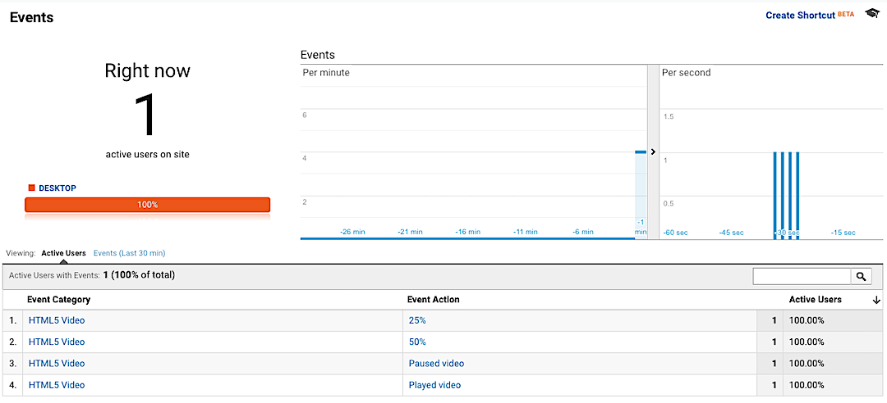
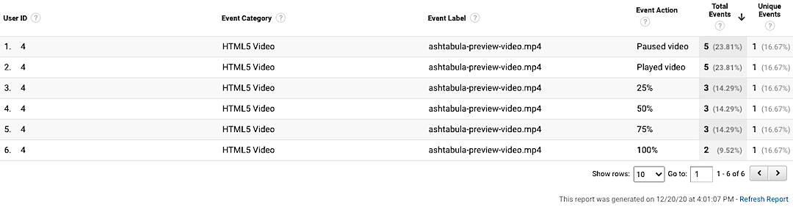

# cme-ga4html5vid

## A WordPress Plugin for HTML5 Video Tracking using Google Analytics

Supports logged-in user ID tracking.
 
Play around with the [live demo](https://streetphotography.blog/html5-video-plugin/).

---

## Install

1. Download the [latest release](https://github.com/marklchaves/cme-ga4html5vid/releases) (zip file) from GitHub.
1. Log in to your WordPress site as an admin.
1. Navigate to Plugins > Add New.
1. Click Upload Plugin.
1. Select the zip file downloaded in step 1.
1. Click Install Now.
1. Click Activate.

Next: Write your filter hook for your user ID custom dimension index.

## PHP Filter Hook

Add a call to the `cme_user_id_custom_dimension_index` filter hook to your child theme’s functions.php file. Change the custom dimension index to match the user ID custom dimension index in your Google Analytics property.

```php
add_filter( 'cme_user_id_custom_dimension_index', function($custom_dimension_index) {
	return '5'; // Change this to match your CD index number that's set in GA.
} );

```

---

## Screen Captures

## Google Analytics Realtime HTML5 Video Events Report


## Google Analytics Custom Report Showing HTML5 Video Events by User ID


---

## Credits

This solution is based on Julius Fedorovicius’ article, HTML5 Video Tracking Recipe for Google Tag Manager posted on [Analytics Mania](https://www.analyticsmania.com/google-tag-manager-recipes/html5-video/).
